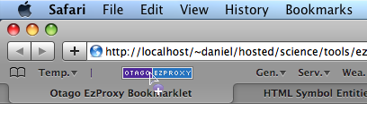

# Otago EzProxy Bookmarklet

Designed to take the frustration out of getting to the "full text" version of journal articles that the University has a paid subscription to.

This bookmarklet will take you to the University of Otago EzProxy login page with your current location pre-appended to the EzProxy login script. Once you have logged in, you will be returned to the page that you were on when you first clicked the bookmarklet. This means that if the University has access to the article you are looking at (via the provider you happened to be viewing it with) then the "full text" options (including PDFs) should be available to you.

This bookmarklet was first developed in 2009. It has worked with almost no modification since then.

## The Bookmarklet

[A bookmarklet](http://www.google.co.nz/search?q=define:Bookmarklet) is a small piece of JavaScript code stored as a URL within a bookmark. All you really need to know is that when you click it, stuff happens. This is it:

## Instructions

1.  You will need to add the bookmarklet to your bookmark list. Clicking
    the bookmarklet on this page directly will not have the desired
    outcome.
2.  The exact procedure will vary according to the browser you are
    using.
    -   In Safari (on the Mac) you can just "drag-n-drop" the
        bookmarklet to your "Bookmarks Bar" (press shift + ⌘ + B to show
        the bookmarks bar).

        

    -   If you are using some other browser you might be able to right
        click and choose "Save As Bookmark", "Bookmark This Link" or
        something similar.
3.  When you are at a page and you want access to the full text: Just
    click the bookmarklet.
4.  Hope and pray the University is subscribed to the journal via the
    provider you happened to be browsing.

Any questions, comments or requests please feel free to [contact
me](/contact).

## Development

**15/05/2010, Version 0.1**

Initial attempt. Currently strips the ?CRETRY=1&SRETRY=0 that is
appended by some (all?) Wiley InterScience pages if you arrive there via
an RSS feed.

    javascript:
        var str=location.href;
        location='https://ezproxy.otago.ac.nz/login?
        url='+str.replace('?CRETRY=1&SRETRY=0','')
    ;
