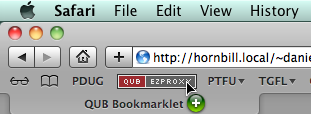

# QUB Bookmarklet

This bookmarklet will try to redirect your browser through the Queen's University Belfast Library servers.  If required, the QUB servers will prompt for a user name and password, but once you have logged in (usually just once per browser instance) you will be returned to the page that you were on when you first clicked the bookmarklet.

The upshot of this is that this bookmarklet should provide 'one click' access to full text journal articles.  Recently the QUB library have improved their catalogue system, but this bookmarklet should still be easier than hitting up the library webpage every time you need to read a journal article.  

If the University does not have full-text access to the journal, or does not pay for access to the journal via the subscriber you are viewing, then your results will vary[^2].

This code was developed during my tenure with QUB (2010 - 2014). Since I no longer work there it is difficult to know if this code still works, but this page remains for posterity.  

## The Bookmarklet

[A bookmarklet](http://www.google.co.nz/search?q=define:Bookmarklet) is a small piece of JavaScript code stored as a URL within a bookmark. There is nothing to it.  Really, this is it:

## Instructions

1.  You will need to add the bookmarklet to your bookmark list [^1]. The exact procedure will vary according to the browser you are using.
    -   In Safari (or most modern browsers) you can just "drag-n-drop" the
        bookmarklet to your "Bookmarks Bar" (press shift + ⌘ + B to show
        the bookmarks bar).

        

    -   If you are using some other browser you might be able to right
        click and choose "Save As Bookmark", "Bookmark This Link" or
        something similar.
2.  When you are at a page and you want access to the full text: Just
    click the bookmarklet.
3.  Hope and pray the University is subscribed to the journal via the
    provider you happened to be browsing.

Any questions, comments or requests please feel free to [contact me]({{ '/contact' | relative_url }}).

## Development

**06/05/2012, Version 0.3**

Actually a regression to a simpler system after noticing that the QUB EzyProxy accepts a `url` GET variable.  

	javascript:
		var str=location.href;
		location='https://queens.ezp1.qub.ac.uk/login?
		url='+str.replace('?CRETRY=1&SRETRY=0','');

**14/04/2012, Version 0.2**

Initial attempt. Implements all features of [UoO bookmarklet][UoO_bookmarklet].

	javascript:
		location=window.location.protocol
		+'//'
		+window.location.hostname
		+'.queens.ezp1.qub.ac.uk'
		+window.location.pathname.replace('?CRETRY=1&SRETRY=0','');

[^1]: Clicking the bookmarklet on this page directly will **not** have the desired outcome.
[^2]: *e.g.* cryptic server errors, or '404 page not found' errors.

[UoO_bookmarklet]: /code/otago_ezproxy_bookmarklet/
