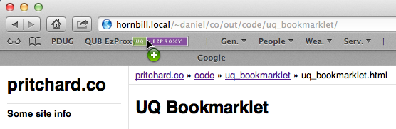

# UQ Bookmarklet

This bookmarklet does the same thing as previous code written for use in [other][oo] [institutions][qub].  

It was developed to support my partner who worked for University Queensland for three years. We have both since left Australia and UQ and so I don't have any real way to know if this code still works. But this page remains for posterity.

## The Bookmarklet

There is nothing to it.  Really, this is it:

## Instructions

1.  You will need to add the bookmarklet to your bookmark list [^1]. The exact procedure will vary according to the browser you are using.
    -   In Safari (or most modern browsers) you can just "drag-n-drop" the
        bookmarklet to your "Bookmarks Bar" (press shift + ⌘ + B to show
        the bookmarks bar).

        

    -   If you are using some other browser you might be able to right
        click and choose "Save As Bookmark", "Bookmark This Link" or
        something similar.
2.  When you are at a page and you want access to the full text: Just
    click the bookmarklet.
3.  Hope and pray the University is subscribed to the journal via the
    provider you happened to be browsing.

Any questions, comments or requests please feel free to [contact me]({{ '/contact' | relative_url }}).

## Development

**09/01/2013, Version 0.2**

The get variable should be 'url' (which is the same as QUB).  

	javascript:
		var str=location.href;
		location='http://ezproxy.library.uq.edu.au/login?
		url='+str.replace('?CRETRY=1&SRETRY=0','');

**07/12/2012, Version 0.1**

Initial attempt. Follows the scheme of the old [QUB Bookmarklet][qub] until I can figure out what the get variable needs to be called.

	javascript:
		location=window.location.protocol
		+'//'
		+window.location.hostname
		+'.ezproxy.library.uq.edu.au'
		+window.location.pathname.replace('?CRETRY=1&SRETRY=0','');

[^1]: Clicking the bookmarklet on this page directly will **not** have the desired outcome.

[uq]: http://www.uq.edu.au
[oo]: {{ '/code/otago_ezproxy_bookmarklet/' | relative_url }}
[qub]: {{ '/code/qub_bookmarklet/' | relative_url }}
[gb]: http://www.cmlr.uq.edu.au/AboutUs/OurPeople/DrGretchenBrownstein.aspx
